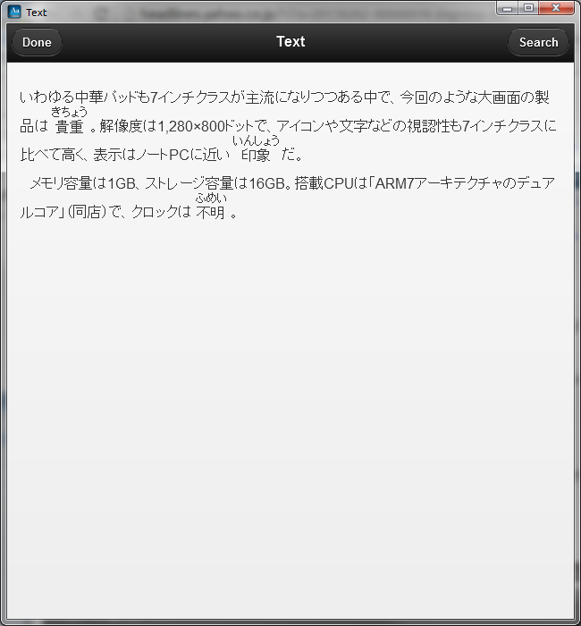
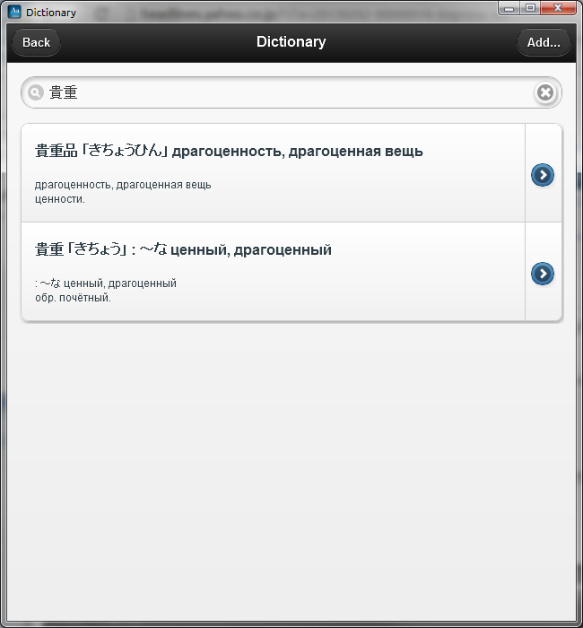
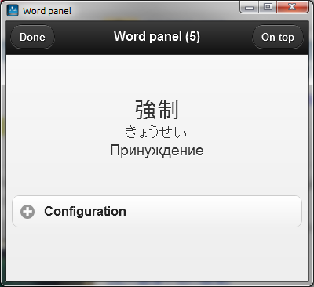

## XRay2 - Japanese texts assistant

### Features
* Built with: Adobe AIR, jquery mobile
* Used for reading e-mails, articles in Japanese
* Has builtin dictionary
* Maintains active vocabulary in plain text files
* Shows inline hiragana and translation hints using active vocabulary
* Searches for translation of selected text in dictionary
* Shows words panel window for better remembering of active vocabulary

### Screenshots

